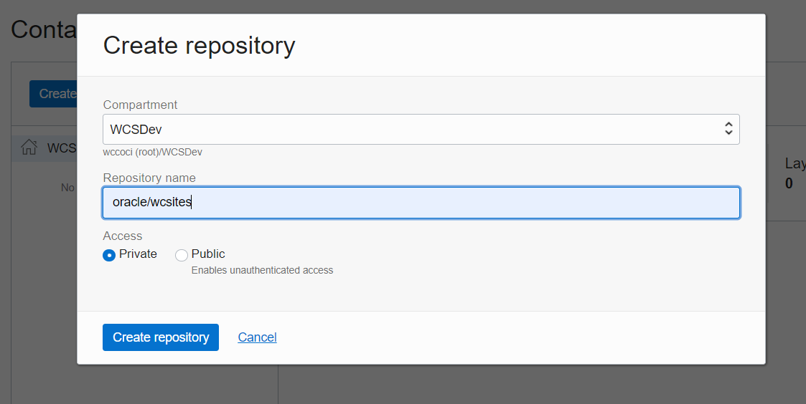
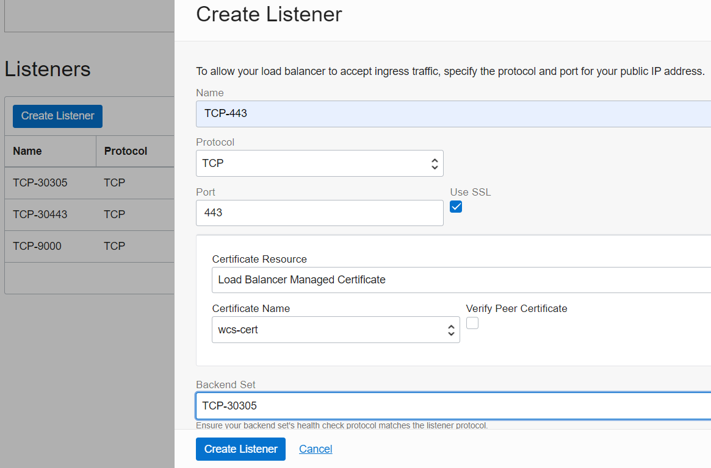
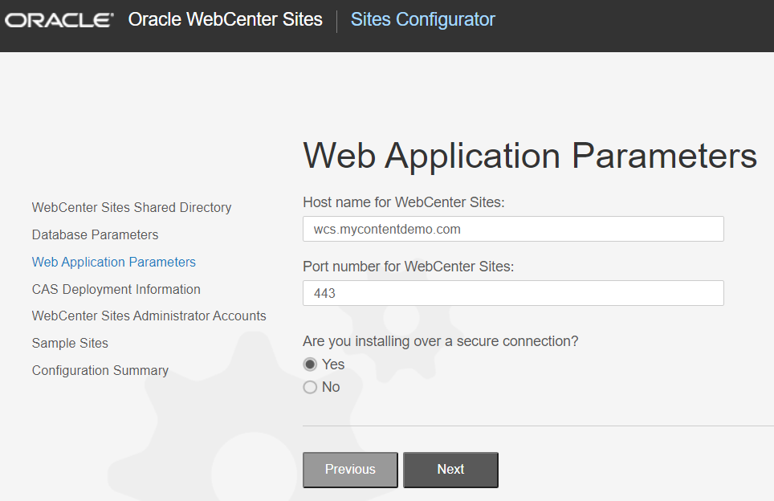
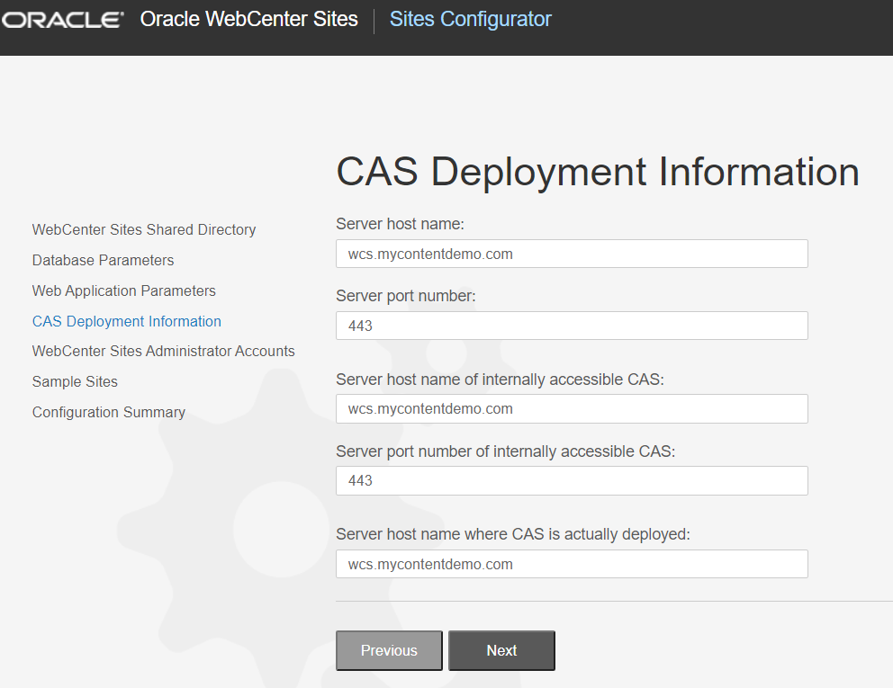

# Terraform scripts for Deploying Oracle WebCenter Sites on Kubernetes

#### Disclaimer

This deployment of Oracle WebCenter Sites makes use of the Terraform scripts and Oracle WebCenter Sites Helm Chart based on the [fmw-kubernetes](https://github.com/oracle/fmw-kubernetes) release.

#### Caveats

Although this release follows the same flow as the [fmw-kubernetes](https://github.com/oracle/fmw-kubernetes) release, only the Traefik ingress controller is currently supported.

#### Contents

* [Prerequisites](#prerequisites)
* [Installation](#installation)
* [Access the Deployment](#access-the-deployment)
* [Deploying with Sub-domain and SSL](#deploying-with-sub-domain-and-ssl)
* [Configure WebCenter Sites](#configure-webcenter-sites)


### Prerequisites

This terraform deployment requires the prior installation of the following:

- **terraform >= 0.14**

	[tfswitch](https://tfswitch.warrensbox.com/Install/) can be used for flexibility of working with multiple versions of terraform, but it is only available on Linux and Mac OS X, for Windows or if you prefer to install the base software, see [https://learn.hashicorp.com/tutorials/terraform/install-cli](https://learn.hashicorp.com/tutorials/terraform/install-cli) for basic installation instructions.

- **kubectl >= 1.18.10 (the Kubernetes cli)**

	See [https://kubernetes.io/docs/tasks/tools/install-kubectl/](https://kubernetes.io/docs/tasks/tools/install-kubectl/) for installation instructions, although kubectl is usually installed as part of Docker Desktop, so if you use Docker it is likely already installed.

- **helm >= 3.5.4**

	Helm is a kubernetes deployment package manager. The OCI Service Broker is packaged in a Helm chart, and so is the etcd cluster deployment.
	See [https://helm.sh/docs/intro/install/](https://helm.sh/docs/intro/install/) to install helm locally.

- **OCI Command Line Interface (CLI)**

	See [https://docs.oracle.com/en-us/iaas/Content/API/SDKDocs/cliinstall.htm](https://docs.oracle.com/en-us/iaas/Content/API/SDKDocs/cliinstall.htm) for a quick starting guide. Make sure you upload your **public key** in your OCI account and note the fingerprint information.

	The OCI CLI is used to configure the access to the OKE cluster locally only, so this deployment could be modified to only use `kubectl` if this is intended for a remote setup, but configuring the CLI helps in several tasks.

- **Follow this document to set up OCI Terraform**
	[https://docs.oracle.com/en-us/iaas/developer-tutorials/tutorials/tf-provider/01-summary.htm](https://docs.oracle.com/en-us/iaas/developer-tutorials/tutorials/tf-provider/01-summary.htm)


### Installation

#### 1. Get the repository

* Download the Terraform scripts to deploy WebCenter Sites from this [repository](https://github.com/oracle/fmw-kubernetes.git).

	```bash
	$ git clone https://github.com/oracle/fmw-kubernetes.git
	```
		
* You can now use the deployment scripts from `fmw-kubernetes/FMWKubernetesMAA/OracleEnterpriseDeploymentAutomation/OracleWebCenterSites` to set up the WebCenter Sites domain as further described in this document. This will be your home directory to run the terraform scripts.

	```bash
	$ cd fmw-kubernetes/FMWKubernetesMAA/OracleEnterpriseDeploymentAutomation/OracleWebCenterSites
	```
		
#### 2. Update terraform.tfvars file

Create a `terraform.tfvars` file from the `terraform.tfvars.template` file and populate the following mandatory information:

```
## Copyright (c) 2022, Oracle and/or its affiliates.
## Licensed under the Universal Permissive License v 1.0 as shown at https://oss.oracle.com/licenses/upl  

tenancy_ocid     = "ocid1.tenancy.oc1..."
compartment_ocid = "ocid1.compartment.oc1..."
region           = "us-ashburn-1"

## Things to provision
# VCN, OKE cluster, node_pool(s)
# if false, the template assumes the cluster is provisioned and that kubectl has access to the cluster.
provision_cluster = true

# File Storage and mount point export
provision_filesystem = true
provision_mount_target = true
provision_export = true

# Database (DBaaS on OCI)
# If false, a database jdbc_connection URL needs to be provided, and the database needs to be reachable from this VCN
provision_database = true

# Autonomous Database (User can use DBAAS or Autonomous DB.  Turn this on if provision_adb is false)
provision_adb = false
# possible values (OLTP)
adb_database_db_workload = "OLTP"
adb_password = "Oradoc_db12W#_"

# WebLogic Operator
provision_weblogic_operator = true
# Ingress controller
provision_traefik = true
provision_secrets = true
#This will deploy the site in environment
provision_sites = true

## File storage details
# If the VCN is not provided by this template, the following variables must be provided
fss_subnet_id = null
# If the cluster and VCN are not provided by this template,
fss_source_cidr = "0.0.0.0/0"
# File Storage mount target Availability Domain index
ad_number = 2

#if using existing file system. exportset and filesystem must belong to same ad.
#filesystem_ocid = ""
#if using existing mount target.
#mount_target_ocid = ""
#mount_target_ip = ""

## Credentials
# Input your Container registry login credentials
# this is the registry where sites images is going to be looked at
container_registry = "phx.ocir.io"
container_registry_username    = "devcec/WCSitesUser"
container_registry_email    = ""
container_registry_password = "MNOPabcd:>123xyZ"
container_registry_image = "oracle/wcsites:12.2.1.4"

# Create WCSites domain Admin Console credentials
sites_domain_admin_username = "weblogic"
# Password must contain 1 Upper, 1 number and be at least 8 characters long
sites_domain_admin_password = "Welcome1"

# Create Database credentials
# Password must be 9 to 30 characters and contain at least 2 uppercase, 2 lowercase, 2 special, and 2 numeric characters.
# The special characters must be _, #, or -.
db_sys_password = "Oradoc_db12W#x_"

# Create RCU Schema credentials
# rcu_prefix must be less than or equals to 5 characters
rcu_prefix = "WCS1"
rcu_username = "WCS1"
# Password must be 9 to 30 characters and contain at least 2 uppercase, 2 lowercase, 2 special, and 2 numeric characters.
# The special characters must be _, #, or -.
rcu_password = "Oradoc_db12W#x_"
# If connecting to an external DB, specify the jdbc_connection_url
# !!! You will need to adjust the security list on your database VCN/subnet to authorize access from the OKE cluster nodes,
# which may require VCN peering (not provided here)
jdbc_connection_url = null

# Database information max 8 charachtor allowed for db system
database_name        = "sitesdb"
database_unique_name = "sitesdb"

# Kubernetes namespaces (no need to change)
#sites_kubernetes_namespace  = "wcsites-ns"
#weblogic_operator_namespace  = "operator-ns"
#ingress_controller_namespace = "traefik"

# Domain name
sites_dns_name =""

# VCN config
vcn_cidr = "10.0.0.0/16"

# SSH key to access database and Kubernetes nodes
ssh_authorized_key = "ssh-rsa AAAAB3NzaC1yc2EAAAADAQABAAABAQDtmEF/NbYdBMiF1XjTPgY6M4Nw8RI9AezkXKk7eJ7YylJH8AAApBb0aw7ERgEza3cTkQVK74MH6Rz9nvi7BdoMB/HWv/Ap/StsqFP2oC3BNi+ljVzXreNtVv1G1JqiRbKzjLNtyHw02wtuTKeoXwaex/ElcAObLdqbuxTgw1M1pw+XnSdnBazqAU6otVpnlgkGNiZDE1yvk7t5tL85tZj8dhrIBGEbHu0/lPA/d15PqgAi5bAIO/E0Dt2vh5hJJMjtM0BWf7PyhMgkOeTszERRHuteBroFbZyzxTvJZiUmL16SMcvLnDt3jL4gIzUkOqBIA9haFyo0poGBC8cYECiB vk"

# Cluster config
oke_cluster = {
  name                                                    = "OKE_Cluster"
  k8s_version                                             = "v1.20.8"
  pods_cidr                                               = "10.1.0.0/16"
  services_cidr                                           = "10.2.0.0/16"
  cluster_options_add_ons_is_kubernetes_dashboard_enabled = true
  cluster_options_add_ons_is_tiller_enabled               = true
}

# defaults to 1 pool, feel free to add more if needed.
node_pools = [
  {
	pool_name  = "pool1"
	node_shape = "VM.Standard2.4"
	node_count = 2
	node_labels = {
	  "pool_name" = "pool1"
	}
  }
]

# Optional parameter, requires a vault and key to be created in the account.
secrets_encryption_key_ocid = null
```	

* Update tenancy_ocid, compartment_ocid, region as per your Oracle Cloud Infrastructure account. 
* Update ssh_authorized_key with your SSH public key. This key used to access database and Kubernetes nodes.   
* If you don't want to create a new database on the Oracle Database Service and want to use an existing database, keep variable provision_database as false and specify the jdbc_connection_url value in the terraform.tfvars config file. 
`Example : jdbc_connection_url = "<Public IP Address>:<Port>/<Pluggable Database Name>.<Host Domain Name>"`
* If you wish to encrypt Kubernetes secrets at rest, you can provision a vault and key and reference this key OCID as secrets_encryption_key_ocid to use in the kubernetes cluster.	

#### 3. Push WCSites Image to OCIR

- **Create Oracle Cloud Infrastructure Registry**

	- Under `Solutions and Platform`, go to `Developer Services` and click `Container Registry`.
	- Click on `Create repository`.
	- Enter Repository name and Access type to create a repository.

	

- **Push wcsites docker image to OCIR**

	- Download latest sites docker image from [here](https://support.oracle.com/epmos/faces/ui/patch/PatchDetail.jspx?patchId=33579457).
	- Unzip the downloaded zip file.

	```bash
	$ unzip p33579457_122140_Linux-x86-64.zip
	```

	Load the image archive using the docker load command.

	```bash
	$ docker load < wcsites-20210422.tar.gz
	```

- **Create an "Auth token" which will be used as docker password to push/pull images from OCIR**	

	- Login to OCI Console, navigate to Profile, User Settings, Auth Tokens, click on Generate Tokens button.
	- Enter Description and then click Generate Tokens.
	- Token will get generated.
	- Copy the generated token. `NOTE: It will only be displayed one time, so you need to copy it to a secure place for further use.` 

- **Docker login**

	Do a docker login on any OCI node where you need to push/pull images :
	```
	docker login <region-key>.ocir.io
	Username: <tenancy-namespace>/oracleidentitycloudservice/<username>
	Password: <enter the auth token you copied earlier>
	```

	example :

	```bash
	$ docker login phx.ocir.io
	Username: axcmmdmzqtqb/oracleidentitycloudservice/<email_id>
	Password:
	```

- **Push an image**
	```
	docker tag <image-identifier> <region-key>.ocir.io/<tenancy-namespace>/<repo-name>:<tag>
	docker push <region-key>.ocir.io/<tenancy-namespace>/<repo-name>:<tag>
	```
	example :

	```bash
	$ docker tag oracle/wcsites:12.2.1.4 phx.ocir.io/axcmmdmzqtqb/oracle/wcsites:12.2.1.4
	$ docker push phx.ocir.io/axcmmdmzqtqb/oracle/wcsites:12.2.1.4
	```

- **Update Container registry details in terraform.tfvars**

	Input your Container registry login credentials in terraform.tfvars file. Update below variables in terraform.tfvars.
		
	```
	container_registry - <registry name>
	container_registry_username - <user name>
	container_registry_email - <email id (optional)> 
	container_registry_password - <password> 
	container_registry_image - <image name>	
	```
	
#### 4. Deploying with Sub Domain

If you want to deploy with sub-domain then update sites_dns_name variable in terraform.tfvars
`sites_dns_name ="<sub-domain name>"`

#### 5. Deployment Options

By default, the template will deploy the following infrastrucutre resources:

* A Virtual Cloud Network (VCN).
* Subnets for the Kubernetes Load Balancers (public subnet) and nodes (private subnet).
* A Kubernetes cluster on the Oracle Kubernetes Engine service.
* A database on the Oracle Database Service.
* A file storage Network File Server (NFS) and mount point export path.
* Security lists to allow proper communication.

On the Kubernetes cluster provisioned, the template also create or deploy:

* Namespaces for the different components.
* The secrets containing the credentials required.
* The required WebLogic Operator Helm chart.
* The required ingress controller (using Traefik).	

#### 6. Deploy the Infrastructure

* Use the following commands:

	```bash
	$ terraform init
	$ terraform plan
	$ terraform apply
	```
	
	and answer Yes at the prompt to deploy the stack.	


### Access the Deployment

* Get the public IP of the load balancer created by the ingress controller
	
	```bash
	$ kubectl get services -n traefik
	```
	
	This should output something like:

	```bash
	NAME      TYPE           CLUSTER-IP   EXTERNAL-IP       PORT(S)                                          AGE
	traefik   LoadBalancer   10.2.13.1    132.226.115.178   9000:31473/TCP,30305:30305/TCP,30443:30443/TCP   7d19h
	```
	
	- If it is still pending, wait a few more minutes before checking again.
	- Get the EXTERNAL-IP value for the load balancer.

* Make sure the WebCenter Sites domain servers are running:
	You can check running pods with:
	
	```bash
	$ kubectl get pods -n wcsites-ns
	```
	You should see:

	```bash
	NAME                                                    READY   STATUS      RESTARTS   AGE
	wcsitesinfra-adminserver                                1/1     Running     0          7d19h
	wcsitesinfra-create-fmw-infra-sample-domain-job-4gdn4   0/1     Completed   0          7d19h
	wcsitesinfra-wcsites-server1                            1/1     Running     0          7d18h
	```
	
	Make sure the STATUS is RUNNING and that READY is 1/1 for pods above before checking the URL.

* With the public IP gathered earlier, browse to `http://PUBLIC_IP:30305/console` to get to the WebLogic console.

* You can log into the console with the `sites_domain_admin_username` and `sites_domain_admin_password` you specified in the `terraform.tfvars` file.


### Deploying with Sub-domain and SSL

If you are deploying WCSites with Sub-domain and SSL then follow below steps else move to Configure WebCenter Sites directly.   
- Map the loadbalancer EXTERNAL-IP with the sub-domain. 
- Get SSL certificates from your DNS provider.
- That includes 3 files :
	* SSL Certificate
	* CA Certificate
	* Private Key

Login to OCI console and go to the Load Balancer created be terraform script in your compartment.

* Go to `Certificates`, Certificate Resource - `Load Balancer Managed Certificate`.
* Click on `add Certificate`. Give a name and add all 3 files.
* Click on `Listeners`.
* Add a new Listener "TCP-443".
* Port - 443 (select SSL checkbox).
* Add certificate here.
* Backend Set - TCP-30305.
* Click on `Save Changes` to save.	



- Configure WebCenter Sites by hitting url : `http://PUBLIC_IP:30305/sites/sitesconfigsetup`
- Update hostname as sub-domain name, port as 443 and secure connection as yes.






### Configure WebCenter Sites

* Configure WebCenter Sites by hitting url : `http://PUBLIC_IP:30305/sites/sitesconfigsetup`
	- When installing, select sample sites to be installed and enter the required passwords. 
	- Do not change the sites-config location. If you change the location, installation will fail.

* After the configuration is complete, edit the domain, and restart the Managed Server.
To stop Managed Servers:
	
	```bash
	$ kubectl patch domain wcsitesinfra -n wcsites-ns --type='json' -p='[{"op": "replace", "path": "/spec/clusters/0/replicas", "value": 0 }]'
	```

	To start all configured Managed Servers:
	
	```bash
	$ kubectl patch domain wcsitesinfra -n wcsites-ns --type='json' -p='[{"op": "replace", "path": "/spec/clusters/0/replicas", "value": 3 }]'
	```

* You can check running pods with:

	```bash
	$ kubectl get pods -n wcsites-ns
	```
	
	You should see:
	
	```bash
	NAME                                                    READY   STATUS      RESTARTS   AGE
	wcsitesinfra-adminserver                                1/1     Running     0          7d19h
	wcsitesinfra-create-fmw-infra-sample-domain-job-4gdn4   0/1     Completed   0          7d19h
	wcsitesinfra-wcsites-server1                            1/1     Running     0          7d18h
	wcsitesinfra-wcsites-server2                            1/1     Running     0          11m
	wcsitesinfra-wcsites-server3                            1/1     Running     0          11m
	```

* Access WebCenter Sites by hitting url : `http://PUBLIC_IP:30305/sites/`

  Incase of Sub-domain with SSL : `https://SUB-DOMAIN/sites/`	
