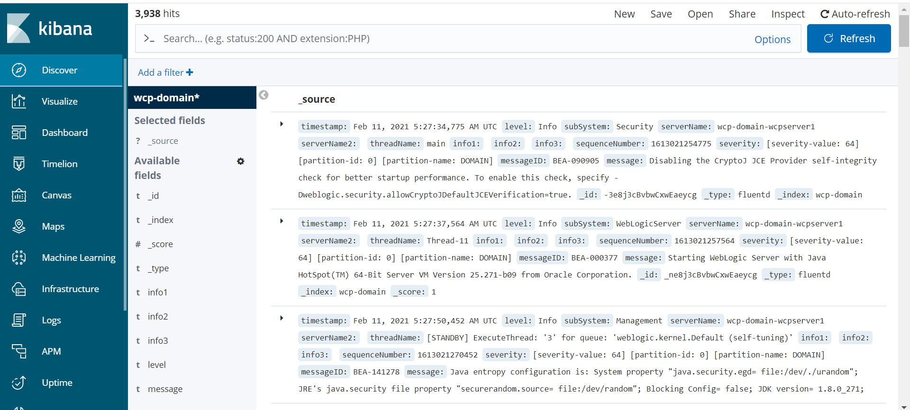

+++
title = " Fluentd"
weight = 1
pre = "<b>a. </b>"
description = "Describes how to configure a WebCenter Portal domain to use Fluentd to send log information to Elasticsearch."
+++

#### Overview
You can configure your WebLogic domain to use *Fluentd* so it can send the log information to Elasticsearch.

Here's how this works:

* `fluentd` runs as a separate container in the Administration Server and Managed Server pods.
* The log files reside on a volume that is shared between the `weblogic-server` and `fluentd` containers.
* `fluentd` tails the domain logs files and exports them to Elasticsearch.
* A `ConfigMap` contains the filter and format rules for exporting log records.


##### Prerequisites

It is assumed that you are editing an existing WebCenter Portal domain. However, you can make all the changes to the domain YAML before creating the domain.
A complete example of a domain definition with fluentd configuration is at the [end of this document](#domain-example).

{} These identifiers  are used in the sample commands.
* `wcpns`: WebCenter Portal domain namespace
* `wcp-domain`: `domainUID`
* `wcp-domain-domain-credentials`: Kubernetes secret 
{}

The sample Elasticsearch configuration is:
```text
    elasticsearchhost: elasticsearch.wcp-domain.sample.com
    elasticsearchport: 443
    elasticsearchuser: username
    elasticsearchpassword: password
```

####  Install Elasticsearch and Kibana

To install Elasticsearch and Kibana, run the following command:
```bash
$  kubectl apply -f kubernetes/samples/scripts/elasticsearch-and-kibana/elasticsearch_and_kibana.yaml
```

#### Configure log files to use a volume
The domain log files must be written to a volume that can be shared between the `weblogic-server` and `fluentd` containers.  The following elements are required to accomplish this:

* `logHome` must be a path that can be shared between containers.
* `logHomeEnabled` must be set to `true` so that the logs are written outside the pod and persist across pod restarts.
* A `volume` must be defined on which the log files will reside. In the example, `emptyDir` is a volume that gets created when a Pod is created.  It will persist across pod restarts but deleting the pod would delete the `emptyDir` content.
* The `volumeMounts` mounts the named volume created with `emptyDir` and establishes the base path for accessing the volume.

**NOTE**: For brevity, only the paths to the relevant configuration are here.  

For Example, run : `kubectl edit domain wcp-domain -n wcpns` and make the following edits:

```yaml
spec:
  logHome: /u01/oracle/user_projects/domains/logs/wcp-domain
  logHomeEnabled: true
  serverPod:
    volumes:
    - emptyDir: {}
      name: weblogic-domain-storage-volume
    volumeMounts:
    - mountPath: /scratch
      name: weblogic-domain-storage-volume
```

#### Add Elasticsearch secrets to WebLogic domain credentials
Configure the `fluentd` container to look for Elasticsearch parameters in the domain credentials.  Edit the domain credentials and add the parameters shown in the example below.

For example, run: `kubectl edit secret wcp-domain-domain-credentials -n wcpns` and add the base64 encoded values of each Elasticsearch parameter:
```text
elasticsearchhost: ZWxhc3RpY3NlYXJjaC5ib2JzLWJvb2tzLnNhbXBsZS5jb20=
elasticsearchport: NDQz
elasticsearchuser: Ym9i
elasticsearchpassword: d2VsY29tZTE=
```

#### Create Fluentd configuration
Create a `ConfigMap` named `fluentd-config` in the namespace of the domain.  The `ConfigMap` contains the parsing rules and Elasticsearch configuration.

Here's an explanation of some elements defined in the `ConfigMap`:

* The `@type tail` indicates that `tail` is used to obtain updates to the log file.
* The `path` of the log file obtained from the `LOG_PATH` environment variable that is defined in the `fluentd` container.
* The `tag` value of log records obtained from the `DOMAIN_UID` environment variable that is defined in the `fluentd` container.
* The `<parse>` section defines how to interpret and tag each element of a log record.
* The `<match **>` section contains the configuration information for connecting to Elasticsearch and defines the index name of each record to be the `domainUID.`
* The `scheme` indicates type of connection between fluentd and Elasticsearch.

The following is an example of how to create the `ConfigMap`:
```bash
cat <<EOF | kubectl apply -f -
apiVersion: v1
kind: ConfigMap
metadata:
  labels:
    weblogic.domainUID: wcp-domain
    weblogic.resourceVersion: domain-v2
  name: fluentd-config
  namespace: wcpns
data:
  fluentd.conf: |
    <match fluent.**>
      @type null
    </match>
    <source>
      @type tail
      path "#{ENV['LOG_PATH']}"
      pos_file /tmp/server.log.pos
      read_from_head true
      tag "#{ENV['DOMAIN_UID']}"
      # multiline_flush_interval 20s
      <parse>
        @type multiline
        format_firstline /^####/
        format1 /^####<(?<timestamp>(.*?))>/
        format2 / <(?<level>(.*?))>/
        format3 / <(?<subSystem>(.*?))>/
        format4 / <(?<serverName>(.*?))>/
        format5 / <(?<serverName2>(.*?))>/
        format6 / <(?<threadName>(.*?))>/
        format7 / <(?<info1>(.*?))>/
        format8 / <(?<info2>(.*?))>/
        format9 / <(?<info3>(.*?))>/
        format10 / <(?<sequenceNumber>(.*?))>/
        format11 / <(?<severity>(.*?))>/
        format12 / <(?<messageID>(.*?))>/
        format13 / <(?<message>(.*?))>/
      </parse>
    </source>
    <match **>
      @type elasticsearch
      host "#{ENV['ELASTICSEARCH_HOST']}"
      port "#{ENV['ELASTICSEARCH_PORT']}"
      user "#{ENV['ELASTICSEARCH_USER']}"
      password "#{ENV['ELASTICSEARCH_PASSWORD']}"
      index_name "#{ENV['DOMAIN_UID']}"
      scheme http
    </match>
EOF
```

#### Mount the ConfigMap as a volume in the `weblogic-server` container
Edit the domain definition and configure a volume for the `ConfigMap` containing the `fluentd` configuration.

**NOTE**: For brevity, only the paths to the relevant configuration are shown.

For example, run: `kubectl edit domain wcp-domain -n wcpns` and add the following portions to the domain definition.  
```yaml
spec:
  serverPod:
    volumes:
    - configMap:
        defaultMode: 420
        name: fluentd-config
      name: fluentd-config-volume
```

#### Add `fluentd` container
Add a container to the domain to run `fluentd` in the Administration Server and Managed Server pods.

The container definition:

* Defines a `LOG_PATH` environment variable that points to the log location of `bobbys-front-end`.
* Defines `ELASTICSEARCH_HOST`, `ELASTICSEARCH_PORT`, `ELASTICSEARCH_USER`, and `ELASTICSEARCH_PASSWORD` environment variables that are all retrieving their values from the secret `wcp-domain-domain-credentials`.
* Includes volume mounts for the `fluentd-config` `ConfigMap` and the volume containing the domain logs.

**NOTE**: For brevity, only the paths to the relevant configuration are shown.

For example, run: `kubectl edit domain wcp-domain -n wcpcns` and add the following container definition.
```yaml
spec:
  serverPod:
    containers:
    - args:
      - -c
      - /etc/fluent.conf
      env:
      - name: DOMAIN_UID
        valueFrom:
          fieldRef:
            fieldPath: metadata.labels['weblogic.domainUID']
      - name: SERVER_NAME
        valueFrom:
          fieldRef:
            fieldPath: metadata.labels['weblogic.serverName']
      - name: LOG_PATH
        value: /u01/oracle/user_projects/domains/logs/wcp-domain/$(SERVER_NAME).log
      - name: FLUENTD_CONF
        value: fluentd.conf
      - name: FLUENT_ELASTICSEARCH_SED_DISABLE
        value: "true"
      - name: ELASTICSEARCH_HOST
        valueFrom:
          secretKeyRef:
            key: elasticsearchhost
            name: wcp-domain-domain-credentials
      - name: ELASTICSEARCH_PORT
        valueFrom:
          secretKeyRef:
            key: elasticsearchport
            name: wcp-domain-domain-credentials
      - name: ELASTICSEARCH_USER
        valueFrom:
          secretKeyRef:
            key: elasticsearchuser
            name: wcp-domain-domain-credentials
            optional: true
      - name: ELASTICSEARCH_PASSWORD
        valueFrom:
          secretKeyRef:
            key: elasticsearchpassword
            name: wcp-domain-domain-credentials
            optional: true
      image: fluent/fluentd-kubernetes-daemonset:v1.3.3-debian-elasticsearch-1.3
      imagePullPolicy: IfNotPresent
      name: fluentd
      resources: {}
      volumeMounts:
      - mountPath: /fluentd/etc/fluentd.conf
        name: fluentd-config-volume
        subPath: fluentd.conf
      - mountPath: /scratch
        name: weblogic-domain-storage-volume
```

#### Verify logs exported to Elasticsearch

The logs are sent to Elasticsearch after you start the Administration Server and Managed Server pods after making the changes described previously.

You can check if the `fluentd` container is successfully tailing the log by executing a command like `kubectl logs -f wcp-domain-adminserver -n wcpns fluentd`.  The log output should look similar to this:
```text
2019-10-01 16:23:44 +0000 [info]: #0 starting fluentd worker pid=13 ppid=9 worker=0
2019-10-01 16:23:44 +0000 [warn]: #0 /scratch/logs/bobs-bookstore/managed-server1.log not found. Continuing without tailing it.
2019-10-01 16:23:44 +0000 [info]: #0 fluentd worker is now running worker=0
2019-10-01 16:24:01 +0000 [info]: #0 following tail of /scratch/logs/bobs-bookstore/managed-server1.log
```

When you connect to Kibana, you will see an index created for the `domainUID`.

#### Domain example

The following is a complete example of a domain custom resource with a `fluentd` container configured.

```yaml
apiVersion: weblogic.oracle/v8
kind: Domain
metadata:
  labels:
    weblogic.domainUID: wcp-domain
  name: wcp-domain
  namespace: wcpns
spec:
  domainHome: /u01/oracle/user_projects/domains/wcp-domain
  domainHomeSourceType: PersistentVolume
  image: "oracle/wcportal:12.2.1.4"
  imagePullPolicy: "IfNotPresent"
  webLogicCredentialsSecret:
    name: wcp-domain-domain-credentials
  includeServerOutInPodLog: true
  logHomeEnabled: true 
  httpAccessLogInLogHome: true
  logHome: /u01/oracle/user_projects/domains/logs/wcp-domain
  dataHome: ""
  serverStartPolicy: "IF_NEEDED"
  adminServer:
    serverStartState: "RUNNING"
  clusters:
  - clusterName: wcp_cluster
    serverStartState: "RUNNING"
    serverPod:
      affinity:
        podAntiAffinity:
          preferredDuringSchedulingIgnoredDuringExecution:
            - weight: 100
              podAffinityTerm:
                labelSelector:
                  matchExpressions:
                    - key: "weblogic.clusterName"
                      operator: In
                      values:
                        - $(CLUSTER_NAME)
                topologyKey: "kubernetes.io/hostname"     
  replicas: 2
  serverPod:
    containers:
    - args:
      - -c
      - /etc/fluent.conf
      env:
      - name: DOMAIN_UID
        valueFrom:
          fieldRef:
            fieldPath: metadata.labels['weblogic.domainUID']
      - name: SERVER_NAME
        valueFrom:
          fieldRef:
            fieldPath: metadata.labels['weblogic.serverName']
      - name: LOG_PATH
        value: /u01/oracle/user_projects/domains/logs/wcp-domain/$(SERVER_NAME).log
      - name: FLUENTD_CONF
        value: fluentd.conf
      - name: FLUENT_ELASTICSEARCH_SED_DISABLE
        value: "true"
      - name: ELASTICSEARCH_HOST
        valueFrom:
          secretKeyRef:
            key: elasticsearchport
            name: wcp-domain-domain-credentials
      - name: ELASTICSEARCH_PORT
        valueFrom:
          secretKeyRef:
            key: elasticsearchhost
            name: wcp-domain-domain-credentials
      - name: ELASTICSEARCH_USER
        valueFrom:
          secretKeyRef:
            key: elasticsearchuser
            name: wcp-domain-domain-credentials
      - name: ELASTICSEARCH_PASSWORD
        valueFrom:
          secretKeyRef:
            key: elasticsearchpassword
            name: wcp-domain-domain-credentials
      image: fluent/fluentd-kubernetes-daemonset:v1.11.5-debian-elasticsearch6-1.0
      imagePullPolicy: IfNotPresent
      name: fluentd
      resources: {}
      volumeMounts:
      - mountPath: /fluentd/etc/fluentd.conf
        name: fluentd-config-volume
        subPath: fluentd.conf
      - mountPath: /u01/oracle/user_projects/domains
        name: weblogic-domain-storage-volume
    env:
    - name: JAVA_OPTIONS
      value: -Dweblogic.StdoutDebugEnabled=false
    - name: USER_MEM_ARGS
      value: '-Djava.security.egd=file:/dev/./urandom -Xms1g -Xmx2g'
    volumeMounts:
    - mountPath: /u01/oracle/user_projects/domains
      name: weblogic-domain-storage-volume
    volumes:
    - name: weblogic-domain-storage-volume
      persistentVolumeClaim:
        claimName: wcp-domain-domain-pvc 
    - emptyDir: {}
      name: weblogic-domain-storage-volume
    - configMap:
        defaultMode: 420
        name: fluentd-config
      name: fluentd-config-volume
  serverStartPolicy: IF_NEEDED
  webLogicCredentialsSecret:
    name: wcp-domain-domain-credentials
```

##### Get the Kibana dashboard port information as shown below:

```bash
-bash-4.2$ kubectl get pods -w
NAME                            READY   STATUS    RESTARTS   AGE
elasticsearch-8bdb7cf54-mjs6s   1/1     Running   0          4m3s
kibana-dbf8964b6-n8rcj          1/1     Running   0          4m3s
```

```bash
-bash-4.2$ kubectl get svc
NAME            TYPE        CLUSTER-IP      EXTERNAL-IP   PORT(S)             AGE
elasticsearch   ClusterIP   10.100.11.154   <none>        9200/TCP,9300/TCP   4m32s
kibana          NodePort    10.97.205.0     <none>        5601:31884/TCP      4m32s
kubernetes      ClusterIP   10.96.0.1       <none>        443/TCP             71d
```
You can access the Kibana dashboard at `http://mycompany.com:kibana-nodeport/`. In our example, the node port is 31884.

#### Create an Index Pattern in Kibana  
Create an index pattern `wcp-domain*` in Kibana by navigating to the dashboard through the Management option. When the servers are started, the log data is shown on the Kibana dashboard.

