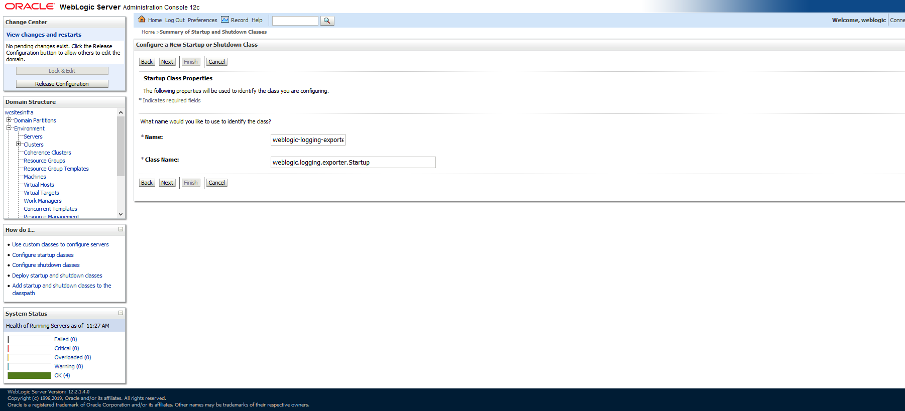
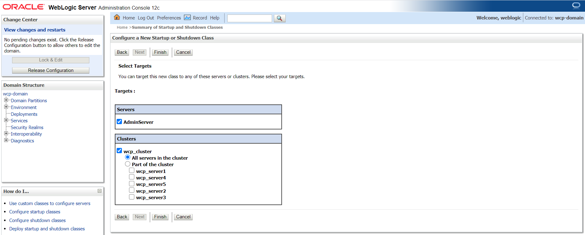
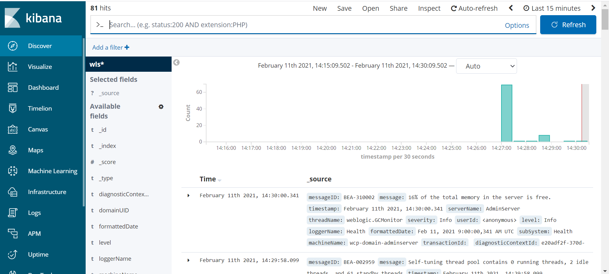

+++
title = "WebLogic logging exporter"
weight = 2
pre = "<b>b. </b>"
description = "Use the WebLogic Logging Exporter to publish the WebLogic Server logs to Elasticsearch."
+++

The WebLogic Logging Exporter adds a log event handler to WebLogic Server which enables WebLogic Server to push the logs to Elasticsearch in Kubernetes by using the Elasticsearch REST API. For more details, see to the [WebLogic Logging Exporter](https://github.com/oracle/weblogic-logging-exporter) project.  

This sample shows you how to publish WebLogic Server logs to Elasticsearch and view them in Kibana. For publishing operator logs, see this [sample](https://oracle.github.io/weblogic-kubernetes-operator/samples/simple/elastic-stack/operator/).

#### Prerequisites

This document assumes that you have already set up Elasticsearch and Kibana for logs collection. If you have not, please see this [document](https://github.com/oracle/weblogic-kubernetes-operator/tree/master/kubernetes/samples/scripts/elasticsearch-and-kibana).

---  

#### Download the WebLogic Logging Exporter binaries

The pre-built binaries are available on the WebLogic Logging Exporter [Releases](https://github.com/oracle/weblogic-logging-exporter/releases) page.  

Download:

* [weblogic-logging-exporter-1.0.0.jar](https://github.com/oracle/weblogic-logging-exporter/releases/download/v1.0.0/weblogic-logging-exporter-1.0.0.jar) from the release page
* [snakeyaml-1.25.jar](https://repo1.maven.org/maven2/org/yaml/snakeyaml/1.25/snakeyaml-1.25.jar) from Maven Central

{} These identifiers are used in the sample commands.
* `wcpns`: WebCenter Portal domain namespace
* `wcp-domain`: `domainUID`
* `wcp-domain-adminserver`: Administration Server pod name
{}

#### Copy the JAR Files to the WebLogic Domain Home

Copy the `weblogic-logging-exporter-1.0.0.jar` and `snakeyaml-1.25.jar` files to the domain home directory in the Administration Server pod.

```bash
$ kubectl cp <file-to-copy> <namespace>/<Administration-Server-pod>:<domainhome>

```

```bash
$ kubectl cp snakeyaml-1.25.jar wcpns/wcp-domain-adminserver:/u01/oracle/user_projects/domains/wcp-domain/

$ kubectl cp weblogic-logging-exporter-1.0.0.jar wcpns/wcp-domain-adminserver:/u01/oracle/user_projects/domains/wcp-domain/
```

#### Add a Startup Class to the Domain Configuration

1. In the WebLogic Server Administration Console, in the left navigation pane, expand **Environment**, and then select **Startup and Shutdown Classes**.

1. Add a new startup class. You may choose any descriptive name, however, the class name must be `weblogic.logging.exporter.Startup`.

    

1. Target the startup class to each server from which you want to export logs.

    

1. In your config.xml file located at, `/u01/oracle/user_projects/domains/wcp-domain/config/config.xml` the newly added startup-class must exist as shown below:
    ```bash
    $ kubectl exec -it wcp-domain-adminserver -n wcpns cat /u01/oracle/user_projects/domains/wcp-domain/config/config.xml
    ```
    ```
    <startup-class>
      <name>weblogic-logging-exporter</name>
      <target>AdminServer,wcp_cluster</target>
      <class-name>weblogic.logging.exporter.Startup</class-name>
    </startup-class>
    ```  

#### Update the WebLogic Server `CLASSPATH`

1. Copy the `setDomainEnv.sh` file from the pod to a local folder:
```bash
$  kubectl cp wcpns/wcp-domain-adminserver:/u01/oracle/user_projects/domains/wcp-domain/bin/setDomainEnv.sh $PWD/setDomainEnv.sh
tar: Removing leading `/' from member names
```
	
Ignore exception: `tar: Removing leading '/' from member names`

1. Update the server class path in `setDomainEnv.sh`:
 ```bash
CLASSPATH=/u01/oracle/user_projects/domains/wcp-domain/weblogic-logging-exporter-1.0.0.jar:/u01/oracle/user_projects/domains/wcp-domain/snakeyaml-1.25.jar:${CLASSPATH}
export CLASSPATH
```  

1. Copy back the modified `setDomainEnv.sh` file to the pod:
```bash
$ kubectl cp setDomainEnv.sh wcpns/wcp-domain-adminserver:/u01/oracle/user_projects/domains/wcp-domain/bin/setDomainEnv.sh
```

#### Create a Configuration File for the WebLogic Logging Exporter  

1. Specify the Elasticsearch server host and port number in the file: `<$WORKDIR>/weblogic-kubernetes-operator/kubernetes/samples/scripts/create-wcp-domain/utils/weblogic-logging-exporter/WebLogicLoggingExporter.yaml`

	Example:
	```
	weblogicLoggingIndexName: wls
	publishHost: elasticsearch.default.svc.cluster.local
	publishPort: 9300
	domainUID: wcp-domain
	weblogicLoggingExporterEnabled: true
	weblogicLoggingExporterSeverity: TRACE
	weblogicLoggingExporterBulkSize: 1
	```  

2. Copy the `WebLogicLoggingExporter.yaml` file to the domain home directory in the WebLogic Administration Server pod:
```bash
$ kubectl cp <$WORKDIR>/weblogic-kubernetes-operator/kubernetes/samples/scripts/create-wcp-domain/utils/weblogic-logging-exporter/WebLogicLoggingExporter.yaml wcpns/wcp-domain-adminserver:/u01/oracle/user_projects/domains/wcp-domain/config/
```  

#### Edit the WebCenter Portal ingress (Only for Voyager Loadbalancer)

By default, paths for wls-exporter are commented in the ingress template. In order to expose the wls-exporter end-point externally, you must edit the WebCenter Portal ingress reapply them if necessary. (See `Using Voyager Loadbalacer`)   


#### Restart the Servers in the Domain

To restart the servers, stop and then start them using the following commands:

To stop the servers:
```bash
$ kubectl patch domain wcp-domain -n wcpns --type='json' -p='[{"op": "replace", "path": "/spec/serverStartPolicy", "value": "NEVER" }]'
```

To start the servers:
```bash
$ kubectl patch domain wcp-domain -n wcpns --type='json' -p='[{"op": "replace", "path": "/spec/serverStartPolicy", "value": "IF_NEEDED" }]'
``` 

After all the servers are restarted, see their server logs to check that the `weblogic-logging-exporter` class is called, as shown below:
```
======================= WebLogic Logging Exporter Startup class called                                                 
Reading configuration from file name: /u01/oracle/user_projects/domains/wcp-domain/config/WebLogicLoggingExporter.yaml   
Config{weblogicLoggingIndexName='wls', publishHost='domain.host.com', publishPort=9200, weblogicLoggingExporterSeverity='Notice', weblogicLoggingExporterBulkSize='2', enabled=true, weblogicLoggingExporterFilters=FilterConfig{expression='NOT(MSGID = 'BEA-000449')', servers=[]}], domainUID='wcp-domain'}
```  

#### Create an Index Pattern in Kibana  
Create an index pattern `wls*` in Kibana by navigating to the dashboard through the Management option. After the servers are started, the log data is displayed on the Kibana dashboard:


