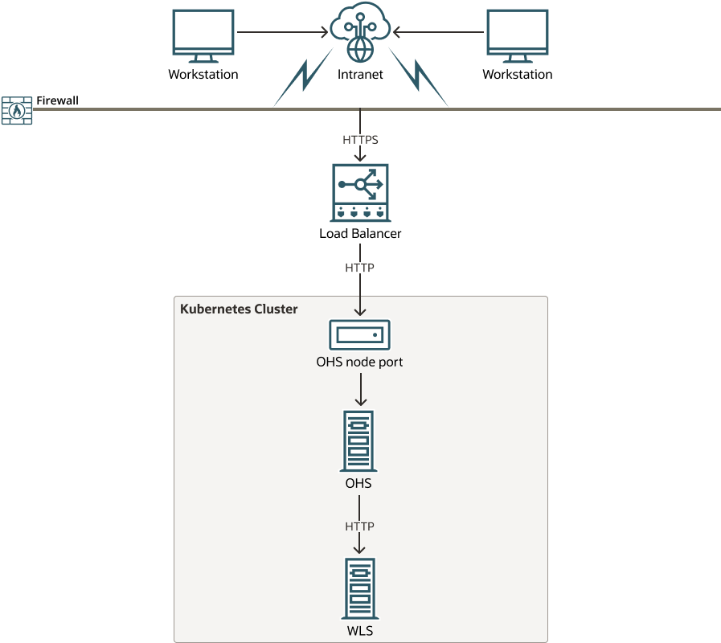
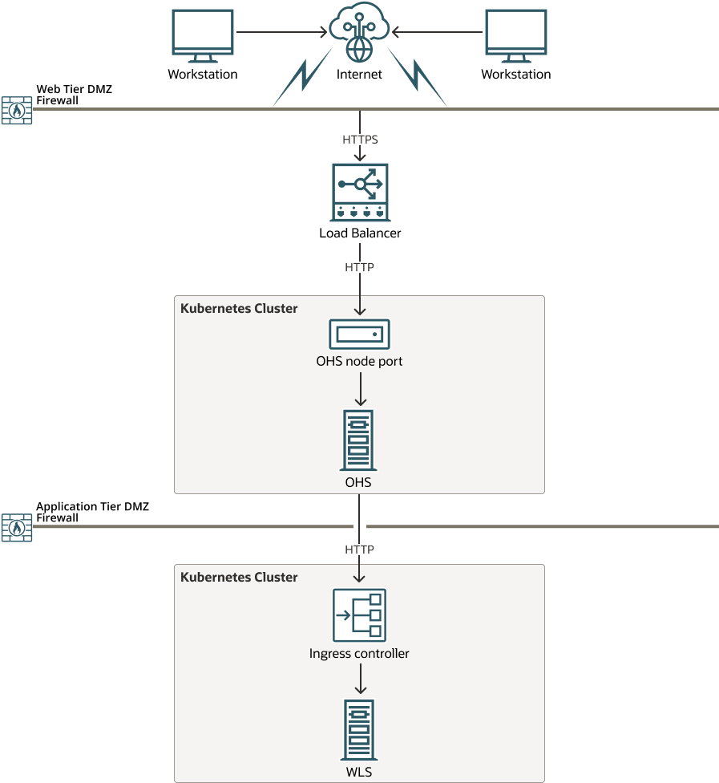

## Introduction

Oracle HTTP Server (OHS) 12.2.1.4 is supported for deployment on Kubernetes.

### Current production release

The current production release for the Oracle HTTP Server 12.2.1.4 deployment on Kubernetes is [25.2.1](https://github.com/oracle/fmw-kubernetes/releases).

### Recent changes and known issues

See the [Release Notes](../release-notes/) for recent changes for Oracle HTTP Server deployment on Kubernetes.

## Getting started

This documentation explains how to configure Oracle HTTP Server (OHS) on a shared Kubernetes cluster where other applications are deployed, or on it's own independent Kubernetes cluster. 

Please note that this documentation does not explain how to configure a Kubernetes cluster given the product can be deployed on any compliant Kubernetes vendor.

This documentation assumes you are familiar with OHS and it's configuration files. It also assumes that if you are using this OHS with Oracle WebGate and Oracle Access Management, that you are familiar with these products.

### Supported architectures

Oracle HTTP Server can be deployed in the following scenarios:

+ Oracle HTTP Server deployed on a shared Kubernetes cluster with other applications.
+ Oracle HTTP Server deployed on an independent Kubernetes cluster.

Before deploying OHS you must consider what architecture to deploy and then plan accordingly.

#### Oracle HTTP Server on a shared Kubernetes Cluster

This deployment is recommended for sandbox and intranet environments only.
 
In this deployment OHS is installed on the same Kubernetes cluster as other Kubernetes deployed applications. For example, you may want to deploy OHS on the same Kubernetes cluster as other Oracle products such as Oracle WebLogic Server, or Oracle Access Management (OAM).

If OHS needs to communicate with other applications on the same Kubernetes cluster, for example using mod_wls_ohs to communicate with Oracle WebLogic Server, then the OHS communicates to the internal port of that Kubernetes service.

An example architecture is as follows:

 
   
[Description of the illustration colocated.png](colocated.txt)

In this example:

+ OHS is deployed in the same Kubernetes cluster as WebLogic Server.
+ SSL is terminated at the load balancer.
+ The load balancer communicates with OHS via the OHS nodeport using HTTP. 
+ OHS communicates with the WebLogic Administration and WebLogic Managed Servers via HTTP, using the internal port of the associated Kubernetes service: `<service_name>.<namespace>.svc.cluster.local:<port>`. The `<service_name>` and `<port>` can be found by running `kubectl get svc -n <namespace>` on your Kubernetes cluster.

**Note**: The load balancer is optional and you can connect direct to the OHS nodeport if required, either from workstations outside the firewall, or internally from other applications.

#### Oracle HTTP Server on an independent Kubernetes cluster

This deployment is recommended for internet facing, production environments.

In this deployment OHS is installed on it's own Kubernetes cluster inside a demilitarized zone.

If OHS needs to communicate with other applications deployed on a different Kubernetes cluster, for example using mod_wl_ohs to communicate with Oracle WebLogic Server, then the OHS communicates via HTTP to the Ingress controller port used by the application on that Kubernetes cluster, or to the appropriate NodePort Kubernetes service you wish to connect to.

An example architecture is as follows:

 
   
[Description of the illustration independent.png](independent.txt)

In this example:

+ SSL is terminated at the load balancer.
+ The load balancer communicates with OHS via the OHS nodeport using HTTP. 
+ Oracle WebLogic Server is deployed on it's own Kubernetes cluster.
+ OHS communicates with the WebLogic Administration and WebLogic Managed Servers using the HTTP port of the Ingress controller configured for WebLogic Server.

**Note**: The load balancer is optional and you can connect direct to the OHS nodeport if required, either from workstations outside the firewall, or internally from other applications.

### Next Steps

For detailed information about the above deployments, start at [Prerequisites](../prerequisites) and follow this documentation sequentially. 

### Documentation for earlier releases

To view documentation for an earlier release, see:

* [Version 25.1.1](https://oracle.github.io/fmw-kubernetes/25.1.1/ohs/)
* [Version 24.4.1](https://oracle.github.io/fmw-kubernetes/24.4.1/ohs/)

